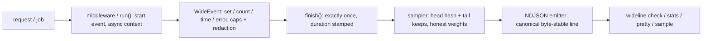

# wideline

[English](README.md) | [中文](README.zh.md) | [日本語](README.ja.md)

[](LICENSE)   [](CONTRIBUTING.md)

**Node.js 向けのオープンソース wide-events ライブラリ — リクエストごとに正準ログイベントを 1 件だけ。フィールド追記、決定的サンプリング、テイルベースのエラー保持、NDJSON ツールキット CLI を依存ゼロで。**


```bash
# not yet on npm — install from a checkout of this repository
npm install && npm run build && npm pack
npm install -g ./wideline-0.1.0.tgz
```

## なぜ wideline？

「observability 2.0」の主張はシンプルだ。リクエストごとに 40 本の散らばったログ行——どれも他の行の文脈を欠く——を吐く代わりに、すべて（ルート、ステータス、所要時間、ユーザープラン、DB 計測、エラー、フィーチャーフラグ）を載せた **wide event を 1 件**発行すれば、あらゆる疑問は 1 枚のテーブルへの group-by になる。従来のロガーにはこれができない。彼らは行プリンタであり、呼んだ回数だけ無関係な行を刷り、リクエストのライフサイクルも exactly-once の保証もなく、コスト問題（「全部 100% 保持」は本番トラフィックの前で崩壊する）への答えも持たない。wideline は欠けていたライフサイクル層だ。ミドルウェアがリクエストごとに正確に 1 件のイベントを開き、どのコードも非同期コンテキスト経由で引数の引き回しなしに追記でき、finish 時——結果が判明した瞬間——に決定的サンプラーが去就を裁定し、エラー・5xx・遅いリクエストは常に保持、生き残りには誠実な再重み付けメタデータを刻む。付属 CLI は生成された NDJSON をオフラインで検証・集計・再サンプルする。

|  | wideline | pino / winston | OpenTelemetry SDK | 手書き JSON ログ |
|---|---|---|---|---|
| リクエストごと 1 イベントを強制 | はい — finish は exactly-once、競合は収束 | いいえ — プリンタ、リクエストあたり N 行 | span はあるが操作単位でリクエスト単位でない | チームの規律頼み |
| どこからでも引き回しなしで追記 | はい — AsyncLocalStorage の `current()` | child logger を手渡しで回す必要 | context API はあるが冗長 | たいていグローバル可変状態 |
| テイルベースのエラー保持 | はい — エラー/5xx/遅延はどのレートでも生存 | サンプリング自体がない | collector 側、もう一つのデプロイ | いいえ |
| 誠実なサンプル重み（`sample.rate`） | はい、パスをまたいで合成可能 | 該当なし | 部分的、collector 依存 | いいえ |
| 正準でバイト安定な行フォーマット | はい — コア固定順 + 残りはソート | キー順 = 呼び出し順 | OTLP、パイプラインが必要 | 開発者ごとにばらばら |
| 同梱のクエリツール | `check` / `stats` / `pretty` / `sample` | なし | なし — バックエンド持参 | なし |
| ランタイム依存 | 0 | 13 / 28 | 73 | 0 |

<sub>依存数はフルインストールツリー（`npm ls --all`）。対象は pino 9、winston 3、@opentelemetry/sdk-node 0.52、確認は 2026-07。</sub>

## 特長

- **リクエストごと 1 イベント、保証付き** — ミドルウェアがライフサイクルを所有：到着で開始、レスポンス完了・エラー・クライアント切断のいずれでも finish は正確に 1 回；二重 finish や finish 後の書き込みはカウントされるだけで反映されない。
- **非同期の境界を越える追記** — `wideline.current()` が AsyncLocalStorage 経由でどこからでも当該リクエストのイベントを解決；`set` はネストをドットキーへ平坦化、`time()` は N 回の DB 呼び出しを `db.ms` + `db.count` に畳み込み、`error()` は型/メッセージ/スタックを記録、ハードな上限が悪意ある入力から行を守る。
- **エラーを決して失わないテイルサンプリング** — 保持/破棄の裁定は結果が判明した finish 時に実行：エラー・5xx・遅延イベントは重み 1 でどのヘッドレートでも生存し、ヘッド保持のイベントは `sample.rate = 1/rate` を帯びて下流の集計は誠実なまま。
- **構造からして決定的** — ヘッド判定はイベント id（または `trace.id`、トレース全体が運命を共にする）を FNV-1a + アバランシェ仕上げでハッシュ：乱数なし、リプレイもテストも本番と一致。
- **秘密はプロセスから出ない** — 組み込みマスキングリスト（password、token、authorization、cookie など）がキー末尾セグメントを大文字小文字を無視して照合、パスのクエリ文字列は常に除去、ネスト平坦化にもマスキングが及ぶ。
- **正準な 1 行と、それを話す道具たち** — コアフィールドが固定順で先頭、残りはソートされ、等しいイベントはバイト単位で同一にシリアライズ；`wideline check` は CI でストリームを検証、`stats` は任意フィールドで加重推定と p50/p95/p99 を計算、`sample` は合成重みでオフライン再サンプル。
- **ランタイム依存ゼロ、I/O のサプライズもゼロ** — 必要なのは Node.js だけ；wideline は渡されたストリームに行を書くのみで、ソケットを開くことは決してない。

## クイックスタート

インストール：

```bash
# not yet on npm — install from a checkout of this repository
npm install && npm run build && npm pack
npm install -g ./wideline-0.1.0.tgz
```

サービスに計装する（以下は Express 風；素の `node:http` は `wrap()` で）：

```js
import { Wideline } from "wideline";

const wideline = new Wideline({
  service: "shop-api",
  version: "1.4.2",
  env: "prod",
  sample: { rate: 0.1, keepErrors: true, slowMs: 250 },
});

app.use(wideline.middleware());

app.post("/checkout", async (req, res) => {
  const event = wideline.current();          // no plumbing required
  event.set("cart.items", req.body.items.length);
  const stop = event.time("db");             // folds into db.ms + db.count
  await chargeCard(req.body);
  stop();
  res.json({ ok: true });
});
```

各リクエストはちょうど 1 行を残す。この 1 件は 10% サンプルレート下でエラーになった——それでも重み 1 で保持（実際のキャプチャ出力）：

```text
{"time":"2026-07-01T12:00:09.584Z","event.id":"req-000044","service":"shop-api","service.version":"1.4.2","env":"prod","host":"web-1","pid":4242,"duration_ms":70,"http.method":"POST","http.route":"/checkout","http.path":"/checkout","http.status":502,"http.request_id":"req-000044","error.type":"UpstreamTimeout","error.message":"upstream timed out after 66ms","error.stack":"UpstreamTimeout: upstream timed out after 66ms\nat PaymentClient.charge (payments.ts:88:11)","error.count":1,"sample.rate":1,"sample.kept_by":"tail:error","cart.items":6,"db.count":1,"db.ms":4,"db.queries":1,"http.bytes_out":11,"http.user_agent":"shop-web/3.2","payment.provider":"cardpay","user.plan":"free"}
```

手元にサーバーがない？ `demo` が決定的な合成トラフィックで実パイプラインを駆動し、`stats` が問いに答える（実際のキャプチャ出力）：

```bash
wideline demo --requests 500 --seed 7 --rate 0.1 --slow-ms 250 | wideline stats -
```

```text
http.route     events  est  err%  p50  p95  p99  max
----------------------------------------------------
/products/:id      28  262   0.8   28   42   43   43
/checkout          32  104   1.9  290  366  368  368
/products          10  100   0.0   34   56   56   56
/health             1   50   0.0    2    2    2    2

71 events (516 estimated pre-sampling)
```

保存したのは 71 行、説明できるのは 516 リクエスト——`est` は `sample.rate` で再重み付けし、しかもエラーは 1 件残らずファイルの中にある。実行可能な例（計装済み `node:http` サーバー、ジョブランナー）は [examples/](examples/README.md) に。

## サンプリング

設定はインスタンスに載せる；裁定はイベントの結果が判明する finish 時に走る。

| キー | 既定値 | 効果 |
|---|---|---|
| `rate` | `1` | ヘッドサンプルレート、範囲 (0, 1]；保持イベントは `sample.rate = 1/rate` を帯びる |
| `byKey` | `"event.id"` | ヘッド判定でハッシュするフィールド — `"trace.id"` でトレース全体が運命を共にする |
| `rules` | `[]` | 一致条件ごとのレート上書き、最初の一致が勝つ（例：`/health` を 1% に） |
| `keepErrors` | `true` | `error.*` か 5xx ステータスを持つイベントはどのレートでも重み 1 で生存 |
| `slowMs` | 無効 | `duration_ms >=` この値のイベントはどのレートでも重み 1 で生存 |
| `keep` | 無効 | 完成フィールドに対するカスタムのテイル述語（例外を投げても安全に破棄） |

保持された各イベントは生存理由を語り（`sample.kept_by`：`always`、`head`、`tail:error`、`tail:slow`、`tail:rule`）、重みは合成される——`wideline sample` での再サンプルは重みを乗算し、何パス経ても推定は誠実なまま。

## CLI リファレンス

全コマンドはファイル引数か stdin（`-`）を読み、完全オフラインで動く。

| コマンド | 動作 |
|---|---|
| `wideline demo --requests N --seed S [--rate R] [--slow-ms N]` | 実ミドルウェア + サンプラー経由の決定的合成ストリームを生成 |
| `wideline check [file] [--quiet]` | [イベントスキーマ](docs/event-schema.md)に照らして検証；問題は行番号付き、終了コード 1 |
| `wideline stats [file] [--by field] [--top N] [--json]` | 任意フィールドでグループ化した加重カウント・エラー率・p50/p95/p99 |
| `wideline pretty [file]` | 人間向けのブロック描画、サマリー行が先頭 |
| `wideline sample [file] --rate R [--by field] [--slow-ms N] [--no-keep-errors]` | 同じヘッド+テイルエンジンでオフライン再サンプル |

終了コード：`0` 成功、`1` 検出あり（`check` が不正ストリームを見た場合）、`2` 用法または入力エラー——パイプラインは悪いデータと悪い呼び出しを区別できる。

## アーキテクチャ



## ロードマップ

- [x] イベントライフサイクルと追記、決定的ヘッドサンプリング、テイルのエラー/遅延/ルール保持、マスキング、正準 NDJSON エミッタ、HTTP ミドルウェア + `wrap()` + `run()`、そして demo/check/stats/pretty/sample CLI（v0.1.0）
- [ ] ローテートするファイルエミッタ：サイズ/期限の上限とシグナルでの再オープン
- [ ] 適応サンプリング：固定レートの代わりにキーごとの目標イベント数/秒
- [ ] `wideline tail`：フィルタとフィールド射影付きでライブストリームを追尾
- [ ] W3C `traceparent` の抽出で、カスタムコードなしに `trace.id` が届くように

完全なリストは [open issues](https://github.com/JaydenCJ/wideline/issues) を参照。

## コントリビュート

コントリビュート歓迎。`npm install && npm run build` でビルドし、`npm test`（88 テスト）と `bash scripts/smoke.sh`（`SMOKE OK` を印字すること）を実行——このリポジトリは CI を持たず、上記の主張はすべてローカル実行で検証されている。[CONTRIBUTING.md](CONTRIBUTING.md) を読み、[good first issue](https://github.com/JaydenCJ/wideline/issues?q=is%3Aissue+is%3Aopen+label%3A%22good+first+issue%22) を掴むか、[discussion](https://github.com/JaydenCJ/wideline/discussions) を始めてほしい。

## ライセンス

[MIT](LICENSE)
