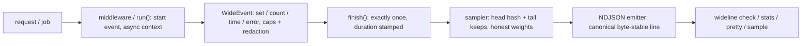

# wideline

[English](README.md) | [中文](README.zh.md) | [日本語](README.ja.md)

[](LICENSE)   [](CONTRIBUTING.md)

**An open-source wide-events library for Node.js — one canonical log event per request, with enrichment, deterministic sampling, tail-based error keeping and an NDJSON toolkit CLI, in zero dependencies.**


```bash
# not yet on npm — install from a checkout of this repository
npm install && npm run build && npm pack
npm install -g ./wideline-0.1.0.tgz
```

## Why wideline?

The "observability 2.0" argument is simple: instead of 40 scattered log lines per request — each missing the context of the others — emit **one wide event** that carries everything (route, status, duration, user plan, db timings, the error, the feature flags) so any question becomes a group-by over one table. Traditional loggers can't give you this: they are line printers, happy to emit as many disconnected lines as you call them with, with no request lifecycle, no exactly-once guarantee, and no answer to the cost problem ("keep 100% of everything" does not survive contact with production traffic). wideline is the missing lifecycle layer: middleware opens exactly one event per request, everything enriches it via async context without plumbing, and at finish — when the outcome is known — a deterministic sampler decides its fate, always keeping errors, 5xx and slow requests while stamping honest re-weighting metadata on what survives. The companion CLI validates, aggregates and re-samples the resulting NDJSON offline.

|  | wideline | pino / winston | OpenTelemetry SDK | hand-rolled JSON logs |
|---|---|---|---|---|
| One event per request, enforced | yes — exactly-once finish, races collapsed | no — a printer, N lines per request | spans, but one per operation, not per request | only by team discipline |
| Enrich from anywhere without plumbing | yes — `current()` via AsyncLocalStorage | child loggers must be passed around | context API, verbose | global mutable state, usually |
| Tail-based error keeping | yes — errors/5xx/slow survive any rate | no sampling at all | in the collector, another deployment | no |
| Honest sample weights (`sample.rate`) | yes, and they compose across passes | n/a | partial, collector-dependent | no |
| Canonical, byte-stable line format | yes — fixed core order, sorted rest | key order = call order | OTLP, needs a pipeline | whatever each dev typed |
| Query tooling in the box | `check` / `stats` / `pretty` / `sample` | no | no — bring a backend | no |
| Runtime dependencies | 0 | 13 / 28 | 73 | 0 |

<sub>Dependency counts are full install trees (`npm ls --all`) of pino 9, winston 3 and @opentelemetry/sdk-node 0.52, checked 2026-07.</sub>

## Features

- **One event per request, guaranteed** — the middleware owns the lifecycle: start on arrival, finish exactly once whether the response completed, errored, or the client vanished; double-finish and post-finish writes are counted, never honored.
- **Enrichment that survives async hops** — `wideline.current()` resolves the request's event anywhere via AsyncLocalStorage; `set` flattens nested objects to dot-keys, `time()` folds N db calls into `db.ms` + `db.count`, `error()` records type/message/stack, and hard caps keep hostile input from bloating the line.
- **Tail-based sampling that never loses an error** — the keep/drop decision runs at finish, when the outcome is known: errored, 5xx and slow events survive any head rate with weight 1, while head-kept events carry `sample.rate = 1/rate` so downstream counts stay honest.
- **Deterministic by construction** — head decisions hash the event id (or `trace.id`, so whole traces sample together) through FNV-1a plus an avalanche finalizer: no RNG, replays and tests agree with production.
- **Secrets never leave the process** — a built-in redaction list (password, token, authorization, cookie, …) matches the last key segment case-insensitively, query strings are stripped from paths, and redaction applies to nested flattening too.
- **A canonical line, and tools that speak it** — core fields first in fixed order, the rest sorted, so equal events serialize byte-identically; `wideline check` validates streams in CI, `stats` computes weighted estimates and p50/p95/p99 by any field, `sample` re-samples offline with composing weights.
- **Zero runtime dependencies, zero I/O surprises** — Node.js is the whole requirement; wideline writes lines to the stream you hand it and never opens a socket.

## Quickstart

Install:

```bash
# not yet on npm — install from a checkout of this repository
npm install && npm run build && npm pack
npm install -g ./wideline-0.1.0.tgz
```

Instrument a service (Express-style shown; `wrap()` covers plain `node:http`):

```js
import { Wideline } from "wideline";

const wideline = new Wideline({
  service: "shop-api",
  version: "1.4.2",
  env: "prod",
  sample: { rate: 0.1, keepErrors: true, slowMs: 250 },
});

app.use(wideline.middleware());

app.post("/checkout", async (req, res) => {
  const event = wideline.current();          // no plumbing required
  event.set("cart.items", req.body.items.length);
  const stop = event.time("db");             // folds into db.ms + db.count
  await chargeCard(req.body);
  stop();
  res.json({ ok: true });
});
```

Every request leaves exactly one line. This one errored under a 10% sample rate — kept anyway, at weight 1 (real captured output):

```text
{"time":"2026-07-01T12:00:09.584Z","event.id":"req-000044","service":"shop-api","service.version":"1.4.2","env":"prod","host":"web-1","pid":4242,"duration_ms":70,"http.method":"POST","http.route":"/checkout","http.path":"/checkout","http.status":502,"http.request_id":"req-000044","error.type":"UpstreamTimeout","error.message":"upstream timed out after 66ms","error.stack":"UpstreamTimeout: upstream timed out after 66ms\nat PaymentClient.charge (payments.ts:88:11)","error.count":1,"sample.rate":1,"sample.kept_by":"tail:error","cart.items":6,"db.count":1,"db.ms":4,"db.queries":1,"http.bytes_out":11,"http.user_agent":"shop-web/3.2","payment.provider":"cardpay","user.plan":"free"}
```

No server handy? `demo` drives the real pipeline over deterministic synthetic traffic, and `stats` answers questions (real captured output):

```bash
wideline demo --requests 500 --seed 7 --rate 0.1 --slow-ms 250 | wideline stats -
```

```text
http.route     events  est  err%  p50  p95  p99  max
----------------------------------------------------
/products/:id      28  262   0.8   28   42   43   43
/checkout          32  104   1.9  290  366  368  368
/products          10  100   0.0   34   56   56   56
/health             1   50   0.0    2    2    2    2

71 events (516 estimated pre-sampling)
```

71 lines stored, 516 requests accounted for — `est` re-weights by `sample.rate`, and every one of the errors is in the file. Runnable examples (an instrumented `node:http` server, a job runner) live in [examples/](examples/README.md).

## Sampling

Configuration lives on the instance; the decision runs at finish, when the event's outcome is known.

| Key | Default | Effect |
|---|---|---|
| `rate` | `1` | head-sampling rate in (0, 1]; kept events carry `sample.rate = 1/rate` |
| `byKey` | `"event.id"` | field hashed for the head decision — use `"trace.id"` to sample whole traces together |
| `rules` | `[]` | per-match rate overrides, first match wins (e.g. `/health` at 1%) |
| `keepErrors` | `true` | events with `error.*` or a 5xx status survive any rate, weight 1 |
| `slowMs` | off | events with `duration_ms >=` this survive any rate, weight 1 |
| `keep` | off | custom tail predicate over the finished fields (a throwing rule drops safely) |

Every kept event says why it survived (`sample.kept_by`: `always`, `head`, `tail:error`, `tail:slow`, `tail:rule`), and weights compose — re-sampling a stream with `wideline sample` multiplies them, so estimates stay honest through any number of passes.

## CLI reference

All commands read a file argument or stdin (`-`) and are fully offline.

| Command | Does |
|---|---|
| `wideline demo --requests N --seed S [--rate R] [--slow-ms N]` | deterministic synthetic stream through the real middleware + sampler |
| `wideline check [file] [--quiet]` | validate a stream against the [event schema](docs/event-schema.md); exit 1 with line-numbered problems |
| `wideline stats [file] [--by field] [--top N] [--json]` | weighted counts, error rates, p50/p95/p99 grouped by any field |
| `wideline pretty [file]` | human-readable blocks, summary line first |
| `wideline sample [file] --rate R [--by field] [--slow-ms N] [--no-keep-errors]` | re-sample offline with the same head+tail engine |

Exit codes: `0` success, `1` findings (`check` on an invalid stream), `2` usage or input error — so a pipeline can tell bad data from a bad invocation.

## Architecture



## Roadmap

- [x] Event lifecycle + enrichment, deterministic head sampling, tail-based error/slow/rule keeping, redaction, canonical NDJSON emitters, HTTP middleware + `wrap()` + `run()`, and the demo/check/stats/pretty/sample CLI (v0.1.0)
- [ ] Rotating file emitter with size/age limits and reopen-on-signal
- [ ] Adaptive sampling: per-key target events/second instead of a fixed rate
- [ ] `wideline tail`: follow a live stream with filtering and field projection
- [ ] W3C `traceparent` extraction so `trace.id` arrives without custom code

See the [open issues](https://github.com/JaydenCJ/wideline/issues) for the full list.

## Contributing

Contributions are welcome. Build with `npm install && npm run build`, then run `npm test` (88 tests) and `bash scripts/smoke.sh` (must print `SMOKE OK`) — this repository ships no CI, every claim above is verified by local runs. See [CONTRIBUTING.md](CONTRIBUTING.md), grab a [good first issue](https://github.com/JaydenCJ/wideline/issues?q=is%3Aissue+is%3Aopen+label%3A%22good+first+issue%22), or start a [discussion](https://github.com/JaydenCJ/wideline/discussions).

## License

[MIT](LICENSE)
