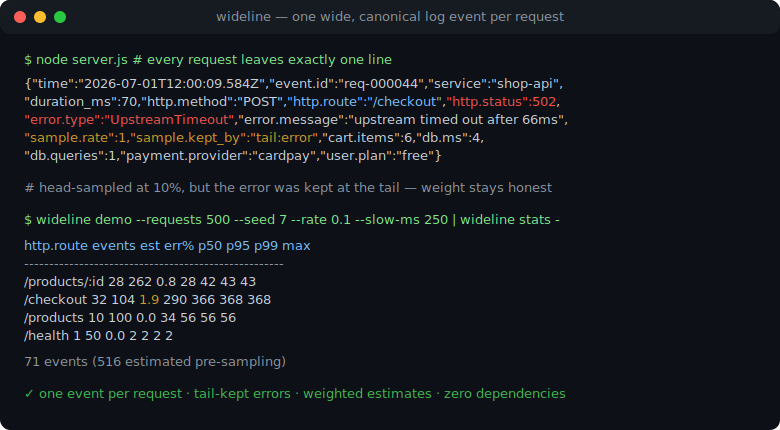
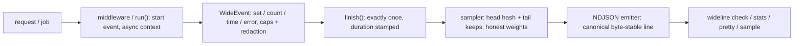

# wideline

[English](README.md) | [中文](README.zh.md) | [日本語](README.ja.md)

[](LICENSE)   [](CONTRIBUTING.md)

**面向 Node.js 的开源 wide-events 库——每个请求恰好一条规范日志事件，内置字段富集、确定性采样、尾部错误保留和 NDJSON 工具链 CLI，零依赖。**



```bash
# not yet on npm — install from a checkout of this repository
npm install && npm run build && npm pack
npm install -g ./wideline-0.1.0.tgz
```

## 为什么选 wideline？

"observability 2.0" 的论点很简单：与其每个请求打出 40 条零散日志——每条都缺少其他行的上下文——不如发出**一条 wide event**，把一切（路由、状态码、耗时、用户套餐、数据库计时、错误、特性开关）都装进去，任何问题都变成对一张表的 group-by。传统日志库给不了这些：它们只是行打印机，你调多少次就打多少条互不相干的行，没有请求生命周期，没有恰好一次的保证，也回答不了成本问题（"100% 全量保留"在生产流量面前根本站不住）。wideline 是缺失的那层生命周期：中间件为每个请求恰好打开一个事件，任何代码都能通过异步上下文富集它而无需层层传参；在 finish 时——结局已知——确定性采样器裁决其去留，错误、5xx 和慢请求永远保留，幸存事件带上诚实的重加权元数据。配套 CLI 可离线校验、聚合、重采样产出的 NDJSON。

|  | wideline | pino / winston | OpenTelemetry SDK | 手写 JSON 日志 |
|---|---|---|---|---|
| 每请求一条事件，强制执行 | 是——finish 恰好一次，竞态被收敛 | 否——打印机，每请求 N 行 | 有 span，但按操作而非按请求 | 只能靠团队自律 |
| 任意位置富集且无需传参 | 是——AsyncLocalStorage 的 `current()` | child logger 必须层层传递 | 有 context API，但繁琐 | 通常靠全局可变状态 |
| 尾部错误保留 | 是——错误/5xx/慢请求在任何采样率下幸存 | 完全没有采样 | 在 collector 里，又是一套部署 | 否 |
| 诚实的采样权重（`sample.rate`） | 是，且可跨多轮复合 | 不适用 | 部分支持，依赖 collector | 否 |
| 规范、字节稳定的行格式 | 是——核心字段定序，其余排序 | 键序 = 调用顺序 | OTLP，需要一条流水线 | 每个开发者各写各的 |
| 自带查询工具 | `check` / `stats` / `pretty` / `sample` | 无 | 无——需要自备后端 | 无 |
| 运行时依赖 | 0 | 13 / 28 | 73 | 0 |

<sub>依赖数为完整安装树（`npm ls --all`），对象为 pino 9、winston 3 与 @opentelemetry/sdk-node 0.52，核对于 2026-07。</sub>

## 特性

- **每请求一条事件，有保证**——中间件掌管生命周期：请求到达即开始，无论响应完成、报错还是客户端消失都恰好 finish 一次；重复 finish 与 finish 后的写入只被计数，绝不生效。
- **跨异步边界的富集**——`wideline.current()` 通过 AsyncLocalStorage 在任意位置解析当前请求的事件；`set` 把嵌套对象摊平成点分键，`time()` 把 N 次数据库调用折叠为 `db.ms` + `db.count`，`error()` 记录类型/消息/堆栈，硬性上限防止恶意输入撑爆行。
- **绝不丢错误的尾部采样**——去留决定在 finish 时做出，此时结局已知：出错、5xx 和慢事件以权重 1 在任何头部采样率下幸存，头部保留的事件则带上 `sample.rate = 1/rate`，下游计数保持诚实。
- **构造级确定性**——头部决定对事件 id（或 `trace.id`，让整条 trace 同进退）做 FNV-1a 加雪崩终混哈希：没有随机数，回放和测试与生产一致。
- **机密不出进程**——内置脱敏列表（password、token、authorization、cookie……）对键的末段大小写不敏感匹配，路径中的查询串一律剥除，嵌套摊平同样受脱敏约束。
- **一种规范行，和会说这门语言的工具**——核心字段以固定顺序在前，其余排序，相同事件字节级一致地序列化；`wideline check` 在 CI 中校验流，`stats` 按任意字段计算加权估计与 p50/p95/p99，`sample` 以复合权重离线重采样。
- **零运行时依赖，零 I/O 意外**——只需要 Node.js；wideline 只向你交给它的流写行，从不打开套接字。

## 快速上手

安装：

```bash
# not yet on npm — install from a checkout of this repository
npm install && npm run build && npm pack
npm install -g ./wideline-0.1.0.tgz
```

给服务插桩（下面是 Express 风格；纯 `node:http` 用 `wrap()`）：

```js
import { Wideline } from "wideline";

const wideline = new Wideline({
  service: "shop-api",
  version: "1.4.2",
  env: "prod",
  sample: { rate: 0.1, keepErrors: true, slowMs: 250 },
});

app.use(wideline.middleware());

app.post("/checkout", async (req, res) => {
  const event = wideline.current();          // no plumbing required
  event.set("cart.items", req.body.items.length);
  const stop = event.time("db");             // folds into db.ms + db.count
  await chargeCard(req.body);
  stop();
  res.json({ ok: true });
});
```

每个请求恰好留下一行。这条在 10% 采样率下出了错——照样保留，权重为 1（真实捕获输出）：

```text
{"time":"2026-07-01T12:00:09.584Z","event.id":"req-000044","service":"shop-api","service.version":"1.4.2","env":"prod","host":"web-1","pid":4242,"duration_ms":70,"http.method":"POST","http.route":"/checkout","http.path":"/checkout","http.status":502,"http.request_id":"req-000044","error.type":"UpstreamTimeout","error.message":"upstream timed out after 66ms","error.stack":"UpstreamTimeout: upstream timed out after 66ms\nat PaymentClient.charge (payments.ts:88:11)","error.count":1,"sample.rate":1,"sample.kept_by":"tail:error","cart.items":6,"db.count":1,"db.ms":4,"db.queries":1,"http.bytes_out":11,"http.user_agent":"shop-web/3.2","payment.provider":"cardpay","user.plan":"free"}
```

手头没有服务？`demo` 用确定性的合成流量驱动真实管线，`stats` 负责回答问题（真实捕获输出）：

```bash
wideline demo --requests 500 --seed 7 --rate 0.1 --slow-ms 250 | wideline stats -
```

```text
http.route     events  est  err%  p50  p95  p99  max
----------------------------------------------------
/products/:id      28  262   0.8   28   42   43   43
/checkout          32  104   1.9  290  366  368  368
/products          10  100   0.0   34   56   56   56
/health             1   50   0.0    2    2    2    2

71 events (516 estimated pre-sampling)
```

存下 71 行，交代了 516 个请求——`est` 按 `sample.rate` 重加权，而且每一个错误都在文件里。可运行示例（插桩的 `node:http` 服务器、作业运行器）见 [examples/](examples/README.md)。

## 采样

配置挂在实例上；裁决在 finish 时执行，此时事件的结局已知。

| 键 | 默认值 | 效果 |
|---|---|---|
| `rate` | `1` | 头部采样率，取值 (0, 1]；保留事件带 `sample.rate = 1/rate` |
| `byKey` | `"event.id"` | 头部决定所哈希的字段——用 `"trace.id"` 可让整条 trace 同进退 |
| `rules` | `[]` | 按匹配覆盖采样率，首个命中生效（例如 `/health` 降到 1%） |
| `keepErrors` | `true` | 带 `error.*` 或 5xx 状态的事件在任何采样率下幸存，权重 1 |
| `slowMs` | 关闭 | `duration_ms >=` 此值的事件在任何采样率下幸存，权重 1 |
| `keep` | 关闭 | 对完成字段的自定义尾部谓词（谓词抛异常时安全丢弃） |

每个保留事件都说明幸存原因（`sample.kept_by`：`always`、`head`、`tail:error`、`tail:slow`、`tail:rule`），且权重可复合——用 `wideline sample` 重采样时权重相乘，估计值经多少轮都保持诚实。

## CLI 参考

所有命令接受文件参数或 stdin（`-`），完全离线。

| 命令 | 作用 |
|---|---|
| `wideline demo --requests N --seed S [--rate R] [--slow-ms N]` | 经真实中间件与采样器生成确定性合成流 |
| `wideline check [file] [--quiet]` | 按[事件模式](docs/event-schema.md)校验流；发现问题带行号并以 1 退出 |
| `wideline stats [file] [--by field] [--top N] [--json]` | 按任意字段分组的加权计数、错误率、p50/p95/p99 |
| `wideline pretty [file]` | 人类可读的块状渲染，摘要行在前 |
| `wideline sample [file] --rate R [--by field] [--slow-ms N] [--no-keep-errors]` | 用同一套头部+尾部引擎离线重采样 |

退出码：`0` 成功，`1` 有发现（`check` 遇到无效流），`2` 用法或输入错误——流水线由此分辨坏数据与坏调用。

## 架构



## 路线图

- [x] 事件生命周期与富集、确定性头部采样、尾部错误/慢/规则保留、脱敏、规范 NDJSON 发射器、HTTP 中间件 + `wrap()` + `run()`，以及 demo/check/stats/pretty/sample CLI（v0.1.0）
- [ ] 轮转文件发射器：大小/时限上限与收信号重开
- [ ] 自适应采样：按键设定目标事件数/秒，替代固定采样率
- [ ] `wideline tail`：跟随实时流，支持过滤与字段投影
- [ ] 解析 W3C `traceparent`，让 `trace.id` 无需自定义代码即可就位

完整列表见 [open issues](https://github.com/JaydenCJ/wideline/issues)。

## 参与贡献

欢迎贡献。用 `npm install && npm run build` 构建，然后运行 `npm test`（88 个测试）和 `bash scripts/smoke.sh`（必须打印 `SMOKE OK`）——本仓库不带 CI，以上所有断言均由本地运行验证。参见 [CONTRIBUTING.md](CONTRIBUTING.md)，认领一个 [good first issue](https://github.com/JaydenCJ/wideline/issues?q=is%3Aissue+is%3Aopen+label%3A%22good+first+issue%22)，或发起一场 [discussion](https://github.com/JaydenCJ/wideline/discussions)。

## 许可证

[MIT](LICENSE)
